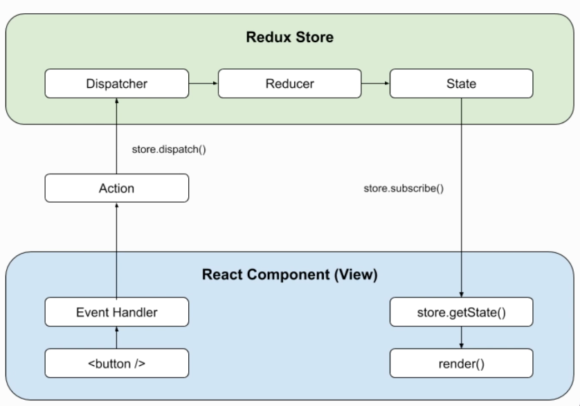
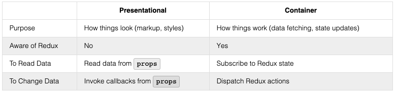

# Week 15 Learning Objectives

## Redux: Part 1

### Describe the Redux data cycle
- redux philosophy:
  - **A Single Source of Truth**: the state for an entire Redux app is stored in a single pojo
  - **State is Read Only**: the state object cannot be directly modified. instead it is modified by dispatching actions.
  - **Changes Are Made with Pure Functions** the reducers that receive the actions and return updated state are pure functions of the old state and the action.
- the store, the actions, then the reducers
- state: all the information stored by that program at a particular point in time.
### Describe the role of the store in the Redux architecture
- Redux stores state in a single store
- holds the frontend state
- provides an API for the frontend state
### Explain what a _reducer_ is
- reducers are functions that make changes to the frontend state
- they are pure functions: behavior depends only on arguments and it has no side effects
- recieves the actions (which are pojos that outline changes to the frontend state), and uses them to actually update the frontend state
### Use the `createStore` method to create an instance of a Redux store
- reducing function that returns the next state tree, given the current state tree and an action to handle.
```javascript
createStore(reducer, [preloadedState], [enhancer]);
// arguments:
// reducer (required) - a reducing function that receives the store's current state and incoming action, determines how to update the store's state, and returns the next state
// preloadedState - an object representing any application state that existed before the store was created.
// enhancer- a function that adds extra functionality to the store.


// an example:
const fruitReducer = (state = [], action) => {
  switch (action.type) {
    case 'ADD_FRUIT':
      return [...state, action.fruit];
    default:
      return state;
  }
};
```
### Use the `store.dispatch` method to dispatch an action to trigger a state update
- broadly, a dispatcher is a mechanism for distributing (or "dispatching") actions to the store
- `store.dispatch()` takes an action as an input parameter, and passes it into the store's `reducer` telling it what information to update.
  - an action is a pojo with a `type` key whose value indicates what action is being performed and optional addtional keys containing any new information
### Use the `store.subscribe` method to listen for state updates
- `store.subscribe()` takes a callback to be triggered whenever the store updates.
- it returns a function, which when invoked, unsubscribes the callback function from the store
```javascript
const display = () => {
  console.log(store.getState());
};

const unsubscribeDisplay = store.subscribe(display);

store.dispatch(addOrange); // [ 'orange', 'orange' ]

// display will no longer be invoked after store.dispatch()
unsubscribeDisplay();

store.dispatch(addOrange); // no output
```
### Use the `store.getState` method to get the current state
- it just returns the current state
### Use a `switch` statement within a reducer function to handle multiple action types
```javascript
const fruitReducer = (state = [], action) => {
  switch (action.type) {
    case 'ADD_FRUIT':
      return [...state, action.fruit];
    case 'ADD_FRUITS':
      return [...state, ...action.fruits];
    case 'SELL_FRUIT':
      const index = state.indexOf(action.fruit);
      if (index !== -1) {
        // remove first instance of action.fruit
        return [...state.slice(0, index), ...state.slice(index + 1)];
      }
      return state; // if action.fruit is not in state, return previous state
    case 'SELL_OUT':
      return [];
    default:
      return state;
  }
};
```
### Describe why it's important for a reducer to avoid mutating the current state when creating the next state
- the whole philosophy of redux is built around the idea that there is a single source of truth for the state of the application, and application state will only update at the appropriate moment in the cycle using a pure function of the previous state and the action
- this is what grants you a better debugging experience, greater reliability, and even features like 'time-travel' (return to a previous state)
### Write an action creator function to facilitate in the creation of action objects
```javascript
const addFruit = (fruit) => ({
  type: ADD_FRUIT,
  fruit,
});
```
### Use constants to define action types to prevent simple typos in action type string literals
- define all state types as constants at the top of the file, e.g.
```javascript
const ADD_FRUIT = 'ADD_FRUIT';
const ADD_FRUITS = 'ADD_FRUITS';
const SELL_FRUIT = 'SELL_FRUIT';
const SELL_OUT = 'SELL_OUT';
const addFruit = (fruit) => ({
  type: ADD_FRUIT,
  fruit,
});

const addFruits = (fruits) => ({
  type: ADD_FRUITS,
  fruits,
});

const sellFruit = (fruit) => ({
  type: SELL_FRUIT,
  fruit,
});

const sellOut = () => ({
  type: SELL_OUT,
});
```

## Redux: Part 2

### Add Redux actions, reducer(s), and a store to a React project
-  separate your store, reducer, and actions into their own files (this is one appropriate way to organize a react/redux project)
- separate folders for actions and reducers, a file called `store.js` for the actual store
### Update a React class component to subscribe to a Redux store to listen for state changes
- there are better ways to do this, but for now you can subscribe in `componentDidMount` and unsubscribe in `componentWillUnmount`. this involves a `forceUpdate` call which is gross
- steps:
  - set up redux
      - `npm install redux`
      - define actions
      - define reducer
      - create store
  - update components
    - use `store.subscribe` to listen for state updates
    - call `store.getState` to retrieve state for rendering
    - call `store.dispatch` to dispatch actions to the store
```javascript
componentDidMount() {
    this.unsubscribe = store.subscribe(() => {
      this.forceUpdate();
    });
  }

  componentWillUnmount() {
    if (this.unsubscribe) {
      this.unsubscribe();
    }
  }
```
### Update a React component to dispatch actions to a Redux store
- e.g. call `store.dispatch(someActionCreatorFunction(payload))` in a click handler function
### Define multiple reducers to manage individual slices of state
```javascript
// ./src/reducers/fruitReducer.js

import {
  ADD_FRUIT,
  ADD_FRUITS,
  SELL_FRUIT,
  SELL_OUT,
} from '../actions/fruitActions';

const fruitReducer = (state = [], action) => {
  switch (action.type) {
    case ADD_FRUIT:
      return [...state, action.fruit];
    case ADD_FRUITS:
      return [...state, ...action.fruits];
    case SELL_FRUIT:
      const index = state.indexOf(action.fruit);
      if (index) !== -1) {
        // remove first instance of action.fruit
        return [...state.slice(0, index), ...state.slice(index + 1)];
      }
      return state; // if action.fruit is not in state, return previous state
    case SELL_OUT:
      return [];
    default:
      return state;
  }
};

export default fruitReducer;
```
```javascript
// ./src/reducers/farmersReducer.js

import { HIRE_FARMER, PAY_FARMER } from '../actions/farmersActions';

const farmersReducer = (state = {}, action) => {
  let nextState = Object.assign({}, state);
  switch (action.type) {
    case HIRE_FARMER:
      const farmerToHire = {
        id: action.id,
        name: action.name,
        paid: false
      };
      nextState[action.id] = farmerToHire;
      return nextState;
    case PAY_FARMER:
      const farmerToPay = nextState[action.id];
      farmerToPay.paid = !farmerToPay.paid;
      return nextState;
    default:
      return state;
  }
};

export default farmersReducer;
You'll also need to define a module containing the 'HIRE_FARMER' and 'PAY_FARMER' actions:

// ./src/actions/farmersActions.js

export const HIRE_FARMER = 'HIRE_FARMER';
export const PAY_FARMER = 'PAY_FARMER';

export const hireFarmer = (name) => ({
  type: HIRE_FARMER,
  id: new Date().getTime(),
  name,
});

export const payFarmer = (id) => ({
  type: PAY_FARMER,
  id,
});

```
### Use the Redux `combineReducers` method to combine multiple reducers into a single root reducer
```javascript
// ./src/reducers/rootReducer.js

import { combineReducers } from 'redux';
import fruitReducer from './fruitReducer';
import farmersReducer from './farmersReducer';

const rootReducer = combineReducers({
  fruit: fruitReducer,
  farmers: farmersReducer
});

export default rootReducer;
```
```javascript
// ./src/store.js
import { createStore } from 'redux';
import rootReducer from './reducers/rootReducer';

const store = createStore(rootReducer);

export default store;
```
### Update a reducer to delegate a state update to a subordinate reducer
```javascript
const farmerReducer = (state, action) => {
  // State is a farmer object.
  switch (action.type) {
    case HIRE_FARMER:
      return {
        id: action.id,
        name: action.name,
        paid: false
      };
    case PAY_FARMER:
      return Object.assign({}, state, {
        paid: !state.paid
      });
    default:
      return state;
  }
};
```
### Describe how container components differ from presentational components

- presentational components are concerned with how things look and container components are concerned with how things work.
- aim to have fewer containers rather than more
### Write a container component to handle all of the Redux store interaction for one or more presentational components
```javascript
// ./src/components/FruitManagerContainer.js

import React from 'react';
import store from '../store';
import { addFruit } from '../actions/fruitActions';
import FruitManager from './FruitManager';

class FruitManagerContainer extends React.Component {
  componentDidMount() {
    this.unsubscribe = store.subscribe(() => {
      this.forceUpdate();
    });
  }

  componentWillUnmount() {
    if (this.unsubscribe) {
      this.unsubscribe();
    }
  }

  add = (fruit) => {
    store.dispatch(addFruit(fruit));
  }

  render() {
    const { fruit } = store.getState();

    return (
      <FruitManager
        fruit={fruit}
        add={this.add} />
    );
  }
}

export default FruitManagerContainer;
```
### Use `Object.freeze` to prevent the current state within a reducer from being mutated
- `Object.freeze(state)` renders an object immutable
### Create a Redux store with preloaded state
- `preloadedState` must match the state shape (as produced by the reducers).
- `preloadedState` is not the same as default state, which should always be set in the reducers
- if you're getting state from local storage, handle persisting state to local storage in the module where you create your store by subscribing to listen for state changes
```javascript
const preloadedState = loadState();

const store = createStore(rootReducer, preloadedState);

store.subscribe(() => {
  saveState(store.getState());
});
```

## Redux: Part 3

### Describe what a higher-order component (HOC) is
- a pattern for reusing component logic. they:
  - Define and return functions
  - Accept callbacks as arguments
  - Or do both.
- higher order components allow you to dynamically generate wrapper components
### Write a higher-order component (HOC) that accepts a component as an argument and returns a new component
```jsx
export const ProtectedRoute = ({ component: Component, path, currentUserId, exact }) => {
  return (
    <Route
      path={path}
      exact={exact}
      render={(props) =>
        currentUserId ? <Component {...props} /> : <Redirect to="/login" />
      }
    />
  );
};

export const AuthRoute = ({ component: Component, path, currentUserId, exact }) => {
  return (
    <Route
      path={path}
      exact={exact}
      render={(props) =>
        currentUserId ? <Redirect to="/" /> : <Component {...props} />
      }
    />
  );
};
```
### Use the React-Redux library's `<Provider />` component to make your Redux store available to any nested components that have been wrapped in the `connect` function\
- to use the `connect` function from the React-Redux library, first add a `<Provider />` component to your React application.
- install the react-redux package
```shell
npm install react-redux
```
- `<Provider />` is a React component which can wrap rest of the application.
  - receives the `store` as a `prop` and sets a store `context`
  - all components can access the store context because the `Provider` wraps the whole application
```jsx
// ./src/index.js

import React from 'react';
import ReactDOM from 'react-dom';
import { Provider } from 'react-redux';
import './index.css';
import App from './App';
import store from './store';

ReactDOM.render(
  <React.StrictMode>
    <Provider store={store}>
      <App />
    </Provider>
  </React.StrictMode>,
  document.getElementById('root')
);
```
### Use the React-Redux library's `connect` function to give a component access to a Redux store
- `connect` is a higher order component that returns a function
- replaces the manually created container component and eliminates the boilerplate code
- connects `WrappedComponent` to the Redux store by:
  - defining the `componentDidMount` and `componentWillUnmount` lifecycle method implementations necessary for managing the subscription to the store to render WrappedComponent when state is updated; and
  - passing slices of state and functions to dispatch actions down to `WrappedComponent` using props.
```jsx
// long version
const createConnectedComponent = connect(
  mapStateToProps,
  mapDispatchToProps
);

const ConnectedComponent = createConnectedComponent(MyComponent);

export default ConnectedComponent;

// this is how it's typically written
export default connect(mapStateToProps, mapDispatchToProps)(MyComponent);
```
```jsx
// Defining mapStateToProps(state, [ownProps])
//  tells connect how to map the state into your component's props
const MyComponent = ({ name }) => (
  <div>{name}</div>
);

const mapStateToProps = (state) => ({
  name: state.name;
});

const ConnectedComponent = connect(mapStateToProps)(MyComponent);

// example with ownProps
const mapStateToProps = (state, ownProps) => ({
  name: state.users[ownProps.match.params.userId].name,
});

const ConnectedComponent = connect(mapStateToProps)(MyComponent);
```

```jsx
// Defining mapDispatchToProps
// accepts the store's dispatch method and returns an object containing functions that can be called to dispatch actions to the store
const deleteTodo = (id) => ({ type: 'DELETE_TODO', id }); // action creators
const addTodo = (msg) => ({ type: 'ADD_TODO', msg });

const mapDispatchToProps = (dispatch) => ({
  handleDelete: (id) => dispatch(deleteTodo(id)),
  handleAdd: (msg) => dispatch(addTodo(msg))
});

const ConnectedComponent = connect(null, mapDispatchToProps)(MyComponent);
```
### Write a selector to extract and format information from state stored in a Redux store
```jsx
// ./src/reducers/farmersSelectors.js

// Returns the state's farmers as an array of farmer objects.
export const getAllFarmers = ({ farmers }) => (
  Object.values(farmers)
);

// Returns the state's farmers as an array of farmer objects,
// filtered by their name.
export const getFilteredFarmers = ({ farmers, filter }) => {
  const lowerCaseFilter = filter.toLowerCase();
  return Object.values(farmers).filter(
    (farmer) => farmer.name.toLowerCase().includes(lowerCaseFilter)
  );
};

// Returns the selected farmer object or an empty farmer object
// if no farmer exists with given id.
export const selectFarmer = ({ farmers }, id) => {
  const nullFarmer = {
    id: null,
    name: '',
    paid: false
  };
  return farmers[id] || nullFarmer;
};
```
### Use the React-Redux library's `applyMiddleware` function to configure one or more middleware when creating a store
- when a dispatch is made, middleware intercepts the action before it reaches the reducer. it may then
  - resolve the action itself (for example, by making an AJAX request),
  - pass along the action (if the middleware isn't concerned with it),
  - generate a side effect (such as logging debugging information),
  - send another dispatch (if the action triggers other actions),
  - or some combination thereof.
```jsx
// ./src/store.js

import { createStore, applyMiddleware } from 'redux';
import logger from 'redux-logger';

import rootReducer from './reducers/rootReducer';

const configureStore = (preloadedState = {}) => {
  return createStore(
    rootReducer,
    preloadedState,
    applyMiddleware(logger),
  );
};

export default configureStore;
```

```jsx
// function signature (set of inputs and outputs to a function)
const middleware = store => next => action => {
 // side effects, if any
 return next(action);
};
```

```jsx
//example custom logger middleware function
const logger = store => next => action => {
  console.log('Action received:', action);
  console.log('State pre-dispatch:', store.getState());

  let result = next(action);

  console.log('State post-dispatch:', store.getState());

  return result;
};
```
### Write a thunk action creator to make an asynchronous request to an API and dispatch an action when the response is received
- if you want the source of all changes to state to be action creators, you need action creators that can handle asynchronicity
- instead of returning a pojo, thunks return functions which, when passed `dispatch` as an argument, can dispatch one or more actions (immediately or later)
- this require middleware (`redux-thunk`) so that actions of the type `function` will be handled appropriately
```jsx
//apply middleware to store
// ./src/store.js

import { createStore, applyMiddleware } from 'redux';
import thunk from 'redux-thunk';
import logger from 'redux-logger';

import rootReducer from './reducers/rootReducer';

const configureStore = (preloadedState = {}) => {
  return createStore(
    rootReducer,
    preloadedState,
    applyMiddleware(thunk, logger),
  );
};

export default configureStore;
```
```jsx
// use a thunk action creator to retrieve data asunchronously
// ./src/actions/fruitActions.js

import { FRUIT_STAND_API_BASE_URL } from '../config';

export const RECEIVE_FRUITS = 'RECEIVE_FRUITS';

export const fetchFruits = () => (dispatch) => (
  fetch(`${FRUIT_STAND_API_BASE_URL}/fruits`)
    .then((res) => res.json())
    .then((data) => {
      dispatch(receiveFruits(data.fruits));
    })
);

const receiveFruits = (fruits) => {
  return {
    type: RECEIVE_FRUITS,
    fruits,
  };
};
```
```jsx
// to dispatch the action,
// ./src/index.js
import React from 'react';
import ReactDOM from 'react-dom';
import { Provider } from 'react-redux';

import './index.css';
import App from './App';
import configureStore from './store';
import { fetchFruits } from './actions/fruitActions';

const store = configureStore();
store.dispatch(fetchFruits());

ReactDOM.render(
  <React.StrictMode>
    <Provider store={store}>
      <App />
    </Provider>
  </React.StrictMode>,
  document.getElementById('root')
);
```
### Describe a situation where defining multiple containers for a single component is advantageous

### Configure a React application to use the Redux development tools
```shell
npm install redux-devtools-extension
```
```jsx
// if you are not using middleware
  import { createStore } from 'redux';
+ import { devToolsEnhancer } from 'redux-devtools-extension';

  import rootReducer from './reducers/rootReducer';

  const configureStore = () => {
    return createStore(
      rootReducer,
+     devToolsEnhancer()
    );
  };

  export default configureStore;

// if you are using middleware
 // ./src/store.js

  import { createStore, applyMiddleware } from 'redux';
  import thunk from 'redux-thunk';
  import logger from 'redux-logger';
+ import { composeWithDevTools } from 'redux-devtools-extension';

  import rootReducer from './reducers/rootReducer';

  const configureStore = () => {
    return createStore(
      rootReducer,
+     composeWithDevTools(applyMiddleware(thunk, logger))
-     applyMiddleware(thunk, logger)
    );
  };

  export default configureStore;
```

## Hooks
### React:
#### Use React's `useState` hook to manage a component's state.
#### Use React's `useState` hook to set a default state, instead of setting the default state in a `constructor()` method.
#### Use React's `useState` hook to update state, instead of the `setState()` method.
#### Use React's `useEffect` hook to manage side effect operations (i.e. data fetching).
#### Use React's `useEffect` hook in replacement of commonly used component lifecycle methods (`componentDidMount`, `componentDidUpdate`, and `componentWillUnmount`).
#### Use React's `useEffect` (and the hook's dependency array) to optimize an application's performance by skipping `useEffect` calls.
#### Use React's `useContext` hook to access a context object, instead of a `Context.Consumer` or the static `contentType` property.
### Redux:
#### Use Redux's `useSelector` hook to access the Redux store's state from within a component (instead of passing a part of state as a prop with the `mapStateToProps` function).
#### Use Redux's `useDispatch` hook to dispatch an action from within a component (instead of passing an thunk action creator function through the `mapDispatchToProps` function).
### React Router:
#### Use React Router's `useParams` hook to match parameters in the current route (instead of accessing the `match.params` prop).
#### Use React Router's `useHistory` hook to navigation from within code (without `<Link>`, `<NavLink>`, or the `history` prop).
#### Use React Router's `useLocation` hook to track url changes.
#### Use React Router's `useRouteMatch` hook to check if the current url matches a path format.

## WebSockets
- WebSockets enable two-way communication between the user's browser (the client) and a server.
- enable dynamic, interactive web experiences
### Use the WebSockets API to create a new WebSocket connection to a server
### Create a WebSocket `onopen` event handler function to detect when the connection has been opened
### Create a WebSocket `onmessage` event handler function to detect and process messages sent by the server
### Create a WebSocket `onerror` event handler function to detect when an error has occurred
### Use the WebSocket `send()` method to send messages to the server
### Recall that WebSocket message data can be sent as JSON formatted string
### Recall that WebSocket messages usually have a "type" associated with them so the client can determine how to process them
### Use the WebSocket `close()` method to close the connection to the server
### Create a WebSocket `onclose` event handler function to detect when the connection to the server has been closed
### Use the `ws` package to create a standalone WebSocket server
### Use the `ws` package to create a WebSocket server that shares a Node.js `http` server with an Express application
### Create an `connection` event handler listener method to detect when a client has connected to the WebSocket server
### Create an `close` event handler listener method to detect when a client has closed the connection to the WebSocket server
### Use the WebSocket `send()` method to send a message to a client
