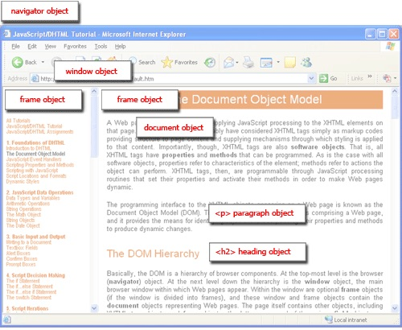

Browser Basics Lesson Learning Objectives

- Explain the difference between the BOM (browser object model) and the DOM(document object model).
    - the `document` object is a web page, and the DOM represents the object hierarchy of the document
    - the browser object model consists of a hierarchy of browser objects—one of which is the `document`
        - the top level object in the BOM is the `window`
        - `window.document` contains a reference to the document the window contains (can be shortened to `document`)
- Given a diagram of all the different parts of the Browser identify each part. Use the Window API to change the innerHeight of a user's window.
  - user interface (UI) is the browser interface. everything except the actual content
  - browser engine manages interactions between UI and rendering engine
  - displays or renders the page content. parses HTML and CSS and render that content
  - networking: handles network calls (e.g. HTTP requests)
  - javascript interpreter: parses and executes js code
  - UI backend: used for drawing basic widgets like combo bozxes and windows; uses operating system user interface methods
  - data storage later: peristance of data stored in browser (e.g. cookies)
    
```javascript
// Open a new window
newWindow = window.open("", "", "width=100, height=100");

// Resize the new window
newWindow.resizeTo(500, 500);
```
- Identify the context of an anonymous functions running in the Browser (the window).
    - `window`
- Given a JS file and an HTML file, use a script tag to import the JS file and execute the code therein when all the elements on the page load (using `DOMContentLoaded`)
    - `DOMContentLoaded` ensures that script will run when the document has been loaded without waiting for stylesheets, images and subframes to load.
```html
<!DOCTYPE html>
<html>
  <head>
    <script type="text/javascript" src="dom-ready-script.js"></script>
  </head>
  <body></body>
  <html></html>
</html>
```
```javascript
window.addEventListener("DOMContentLoaded", event => {
  console.log("This script loaded when the DOM was ready.");
});
```
- Given a JS file and an HTML file, use a script tag to import the JS file and execute the code therein when the page loads
```html
<!DOCTYPE html>
<html>
  <head>
    <script type="text/javascript" src="window-load-script.js"></script>
    </head>
  <body></body>
  <html></html>
</html>
```
```javascript
window.onload = () => {
  console.log(
    "This script loaded when all the resources and the DOM were ready."
  )
}
```
- Identify three ways to prevent JS code from executing until an entire HTML page is loaded
  - use `DOMContentLoaded` event in external JS file (event listener)
    - `window.onload` or `window.addEventListener("DomContentLoaded"...)`
  - put a `<script>` tag importing you external code at the bottom of your html file
  - use `async defer` in the script tag in the html file
- Label a diagram on the Request/Response cycle.
- Explain the Browser's main role in the request/response cycle.
    - Parsing HTML,CSS, JS
    - Rendering that information to the user by constructing a DOM tree and rendering it)
- Given several detractors - identify which real-world situations could be implemented with the Web Storage API
  - the critical piece is that Web Storage API is only useful when we only need the stuff stored client-side
    - shopping cart, forms saving inputs etc.
- Given a website to visit that depends on cookies (like Amazon), students should be able to go to that site add something to their cart and then delete that cookie using the Chrome Developer tools in order to empty their cart.
  - go into inspector, "application" tab, under cookies
    - delete, refresh page, see what changes
    - names are cryptic by design, possibly?
  - on amazon, this is the "session-id"
    - unless you're logged in, in which case the cart may be stored somewhere other than just Web Storage API
