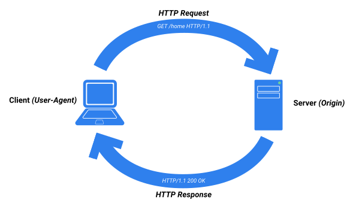
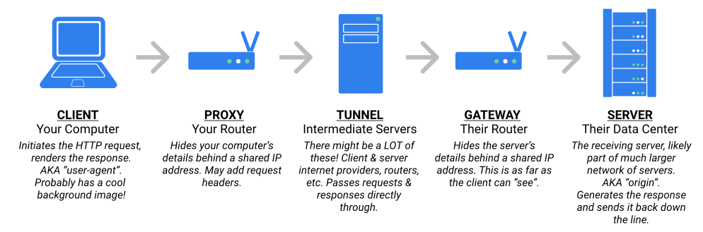

# Week 6 Learning Objectives

## HTTP
### The objective of this lesson is for you to get comfortable with the main concepts of HTTP.
- HTTP (Hypertext Transfer Protocol) is the underlying protocol used by the World Wide Web.
    - hypertext: content with references to other content
    - transfer protocol: defines the process of exchanging data
    - HTTP works like a series of distinct questions and answers between clients and servers
        - client requests a resource (webpage, image, application data)
        - server responds with that resource or an explanation of why request failed
        - HTTP is stateless (doesn't store information), but supports cookies (which get sent along with requests)
    
    - requests may pass through various intermediaries (other servers and devices), e.g. proxies, gateways, tunnels
    

### identify common HTTP verbs and status codes
- verbs: GET, PUT, PATCH, POST, DELETE
- status codes: (200, 302, 400, 401, 402, 403, 404, 500)
### demonstrate how HTTP is used by setting up a simple server.
### match the header fields of HTTP with a bank of definitions.
- headers are key/value pairs that define metadata needed to process the request
- request headers:
    - `Host`: root path for uniform resource indicator (typically the domain)
    - `User-Agent`: which browser the request originated from
    - `Referer`: the URL you're coming from (when applicable)
    - `Accept`: indicates what the client can recieve (e.g. setting it to `application/json` to get aresponse in JSON format instead of HTML)
    - `Content-*` content headers define details about the body of the request (only included with requests that have bodies)
- response headers:
    - `Location`: URL the client should redirect to
    - `Content-Type`: format of the body
    - `Expires`: when the response is no longer valid
    - `Content-Disposition`: how to display the response
    - `Set-Cookie`: sends data back to client to set on the cookie
### match HTTP verbs (GET, PUT, PATCH, POST, DELETE) to their common uses.
- `GET`: direct requests (no body)
- `POST`: creating new resources on the server (e.g. form submission)
- `PUT`: updating a resource on the server (contains whole resource to update)
- `PATCH`: update a resource, but contains only the information to update, not the whole resource
- `DELETE`: destroy resources on the server
### match common HTTP status codes (200, 302, 400, 401, 402, 403, 404, 500) to their meanings.
- status codes are a numeric representation of the server's response
- `100-199`: Informational
- `200-299`: Successful
    - `200 OK`: request received and fulfilled (comes with a `body` containing the requested resource)
    - `201 Created`: request received and new record created (e.g. in response to `POST` request)
- `300-399`: Redirection
    - `301 Moved Permanently`
    - `302 Found`: (may indicate a permanent move where old domain is still valid)
        - commonly used for the transition from HTTP to HTTPS
- `400-499`: Client Error
    - `400 Bad Request`: when request is malformed
    - `401 Unauthorized`: client isn't logged in or necessary credentials weren't accepted
    - `403 Forbidden`: client doesn't have correct permissions
    - `404 Not Found`: resource does not exist
- `500-599`: Server Error
    - `500 Internal Server Error` the request was received, but there was a failure to process it (e.g. server-side bug)
    - `504 Gateway Timeout
### send a simple HTTP request to `google.com`
- use `netcat` to open a direct connection with a URL and manually send HTTP requests
```
nc -v google.com 80
GET / HTTP/1.1
Host: google.com
```
### write a very simple HTTP server using ‘http’ in node with paths that will result in the common HTTP status codes.


## Promises Lesson Learning Objectives I

### Instantiate a `Promise` object
### Use `Promises` to write more maintainable asynchronous code
### Use the `fetch` API to make `Promise`-based API calls

## Promises Lesson Learning Objectives II

### Use `async`/`await` with promise-based functions to write asynchronous code that behaves synchronously.


## HTML Learning Objectives
### The objective of this lesson is for you to know how to effectively use HTML5 to build semantically and structurally correct Web pages.
HTML is the language that renders the cross-platform human-computer interfaces that made the World Wide Web accessible by the world! You'll be able to create structurally and semantically valid HTML5 pages using the following elements:
- html
- head
- title
- link
- script
- The six header tags
- p
- article
- section
- main
- nav
- header
- footer
- Itemized list tags
    - ul
    - ol
    - li
    - a
- img
- Tabular-data tags
    - table
    - thead
    - tbody
    - tfoot
    - tr
    - th
    - td

## Testing
### Explain the "red-green-refactor" loop of test-driven development.
### Identify the definitions of SyntaxError, ReferenceError, and TypeError
### Create, modify, and get to pass a suite of Mocha tests
### Use Chai to structure your tests using behavior-driven development principles.
### Use the pre- and post-test hooks provided by Mocha
