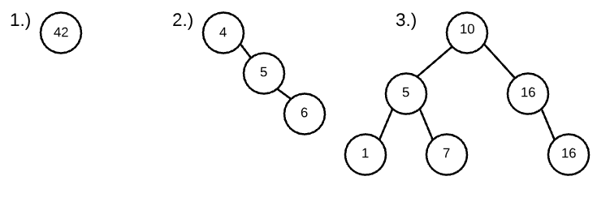

# Week 8 Learning Objectives

## White-Boarding (Probably not on the exam)
- Why
    - tests how to solve real problems
    - how you perform in a  team
    - communication skills
    - coding skills
- steps
    - clarification/edge cases
        - talk about input/output without talking about code
    - formulate approach
    - pseudocode
    - code it
    - walk through example
    - time space complexity/ improvement
- strategies
    - bucketize
    - dynamic programming
    - mathematical properties
    - multiple pointers for same iteration

## Binary Trees
### Explain and implement a Binary Tree.
- defining characteristics of a binary tree:
    - is composed of nodes and edges—it is a subtype of graph
    - has no cycles—there is no path that begins and ends at the same node
    - has a single, top-level node or "root" from which all other nodes can be accessed through edges
    - it is "binary" in that each node can have no more than two children
- terminology:
    - parent nodes / internal nodes - nodes with children
    - leaf nodes - nodes without children
    - sibling nodes - nodes with the same parent
    - subtree - any non-root node and all of its children
    - path - a series of nodes that can be traveled through edges
    - breadth first search - access all the nodes at a given level before descending
    - depth first search - access all children of a given child before going on to its sibling
```javascript
class TreeNode {
    constructor(val) {
        this.val = val;
        this.left = null;
        this.right = null;
    }
}
function preorder (root) {
    return (!root) ? [] : [root.val, ...preorder(root.left), ... preorder(root.right)]
}
function inorder (root) {
    return (!root) ? [] : [ ...inorder(root.left), root.val, ... inorder(root.right)]
}
function postorder (root) {
    return (!root) ? [] : [ ...postorder(root.left), ... postorder(root.right), root.val]
}
```
### Identify the three types of tree traversals: pre-order, in-order, and post-order.
- pre-order, in-order, and post-order are all depth first searches
- pre-order:
    - access value of node
    - recursively visit left subtree
    - recursively visit right subtree
- in-order:
    - recursively visit left subtree
    - access value of node
    - recursively visit right subtree
- post-order (explore each branch as far as you can before back tracking)
    - recursively visit left subtree
    - recursively visit right subtree
    - access value of node
### Explain and implement a Binary Search Tree.
- a binary search tree is a binary tree where
    - the left subtree contains values less than the root
    - the right subtree contains values greater than or equal to the root
    - the left subtree is a binary search tree
    - the right subtree is a binary search tree
- operations:
    - add
    - has
    - remove
        - if two children:
            - go to right child
            - go down the left branch as far as you can (this accesses the greatest node in the tree that is still less than the node that is being removed)
            - copy that value to the location of the node you want to remove and delete the leaf
        - if one child
            - remove the node and attach the single child in its place
        - no children
            - just remove leaf
- examples
- 
```javascript
class TreeNode {
    constructor(val) {
        this.val = val;
        this.left = null;
        this.right = null;
    }
}
```
## Graphs
## Network Knowledge
