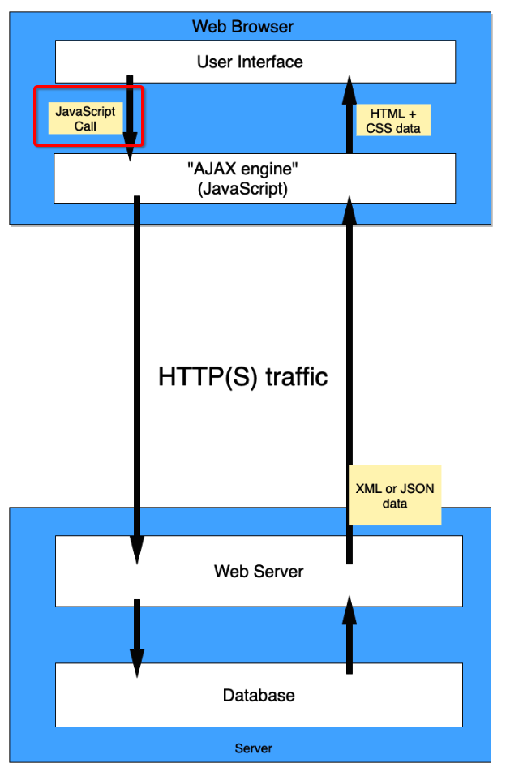

# Week 9 Learning Objectives

## Crafting Resume Bullet Points
### Recall the four components of a good resume bullet point
1. Determine a compelling way to express what you want to demonstrate using _powerful verbs_
2. Carefully choose the appropriate _technical keywords_ that apply to the skill to get your resume noticed by keyword searches
3. Mention the _programming concepts_ that you use to demonstrate the skill
4. Use plain English, describe the _benefits_ or _impact_ that your solution created
### Demonstrate that you can write a good resume bullet point using those four components

## CSS Fundamentals
### Demonstrate how to import other CSS files into your CSS file

### Explain how CSS rules are applied based on their order and specificity
### Describe and apply element, id, and class selectors
- type selectors:  matches elements by node type (e.g. `div`, `li`, `a`, `p`)
- class selectors: matches elements by class name (class name preceded by a `.`)
-
- ID selectors: matches elements by ID

```css
/* Type selector */
div {
  background-color: #000000;
}

/* Class selector */
.active {
  color: #ffffff;
}

/* ID selector */
#list-1 {
  border: 1px solid gray;
}

/* Universal selector */
* {
  padding: 10px;
}

/* Attribute selector */
a[title] {
  font-size: 2em;
}
```
### Write "combinators" to create compound selector statements to target specific elements
- use with moderation????
- descendent selectors
    - two selectors with just white space in between them (syntax: A(spaces, tabs, line breaks)B)
- direct child selectors
    - the `>` selector selects nodes that are direct children of the first element (syntax: A > B). It will match every element B that is immediately nested inside an element A.
- adjacent sibling selectors
    - the `+` selector selects adjacent siblings (syntax: A + B). This means that the second element (B) directly follows the first (A), and both share the same parent.
### Explain and apply pseudo selectors for specific elements in specific states
- pseudo-class specifies a special state of the selected element(s) rather than to any elements or attributes contained in the DOM
```css
a:hover {
  font-family: "Roboto Condensed", sans-serif;
  color: #4fc3f7;
  text-decoration: none;
  border-bottom: 2px solid #4fc3f7;
}
```
### Explain and apply the `::before` and `::after` pseudo selectors
- create a pseudo-element as a child of the element to which the property applies
### Style content on an HTML page targeting
- Type faces, sizes, styles, and weights
- Text transformation and alignment
- Colors expressed as names, hexadecimal RGB values, and decimal RGB values
- Everything about borders
- Shadows
- Opacity (transparency)
- Covering an element with a background image
### Explain the generic font names "serif", "sans-serif", and "monospace" and correctly identify examples of each
- serif fonts have little extensions coming off the letters. <span style="font-family:serif">serif fonts look like this</span>
- sans serif fonts look like all the regular text on this page
- monospace: equally spaced when you're programming: `looks like this`
### Explain why using Web fonts helps with consistent experience across viewing devices
### Recall and explain the different absolute and relative length units in CSS
- px
- em
- rem
### Demonstrate how to link a stylesheet into an HTML page
```html
<head>
    <link rel="stylesheet" href="/styles/site.css">
</head>
```
### Be able to calculate the specificity of CSS rules and determine which rule override the properties of another
- the more specific the rule, the higher priority has
- for equal specifity rules, the last one will be used
### Use the `content` CSS property to define the content of an element

## AJAX
### Explain what an AJAX request is
- ajax (asynchronous javascript and xml) is a set of web development techniques to allow client side applications to send and retrieve data from the server and update pieces of the page, all without interrupting the client's experience and the page's behavior
### Identifying the advantages of using an AJAX request.
- improved user experience (e.g. user can stay on the same place in the page)
- improved application performance
### Identify what the acronym AJAX means and how it relates to modern Web programming
- ajax stands for asynchronous javascript and xml. the modern web relies on ajax constantly—most major websites require frequent interactions with the server but are expected to have a seamless user experience
### Describe the different steps in an AJAX request/response cycle

- event occurs in the user interface (e.g. button click)
- event is handled by javascript code (e.g. `eventListener('click', ...`)
- a request is sent to the server (e.g. using fetch api)
- server responds in the form of XML or (more likely) JSON data
- fetch api recieves response and resolves promise
- response is handled and DOM is updated
### Fully use the `fetch` API to make dynamic Web pages without refreshing the page
```javascript
// example from reading
document.querySelector(".want-to-read").addEventListener("click", function() {
    fetch(`https://api.goodreads.com/books/${BOOK_ID}/update-status`, {
      method: "PATCH", // using PATCH since we'll just be modifying the book's status
      headers: {
        "Content-Type": "application/json"
      },
      body: JSON.stringify({
        status: "Want to Read"
      })
    })
      .then(function(res) {
        if (!res.ok) {
          throw Error(res.statusText); // handle any potential server errors
        }
        return res.json(); // extract JSON from the response
      })
      .then(function(data) {
        document.querySelector(".want-to-read").innerHTML = "✓ Want To Read";
      })
      .catch(function(error) {
        const errorMessage = document.createElement("p");
        errorMessage.appendChild(
          document.createTextNode("Something went wrong. Please try again!")
        );

        // This example appends an error message to the body for simplicity's sake.
        // Please do not copy this kind of DOM manipulation in your own projects:
        document.querySelector("body").appendChild(errorMessage);
      });
  });
```
## Media Query
### Identify the different types of media that a media query can target
### Explain how the media features (and prefixed subfeatures) of "aspect ratio", "height", "orientation", and "width" are applied
### Use media queries to change the styles of content in an HTML page to achieve a desired effect

## Box Model and Positioning
### Describe how:
- padding and margins work in the box model
- the browser positions a fixed positioned element
- the browser positions a relatively positioned element
- the browser positions absolutely positioned elements with and without a relatively positioned parent element
- the browser positions a static positioned element
### Identify elements rendered with specific padding and margin settings
### Apply padding and margins to HTML elements to achieve a desired layout
### Apply positioning settings to elements (fixed, relative, and absolute) to ### HTML elements to achieve a desired layout
### Identify which HTML elements have a default "inline" display value
### Identify which HTML elements have a default "block" display value
### Describe and use z-index positioning of elements

## Flexible Box Model
### Explain how flexible box layout lays out elements
### Use the `flex` property to specify grow, shrink, and basis values.
### Use the `flex-direction` property to direct the layout of the content
### Use the `flex-wrap` property to affect the wrap of content layout within an element using flexible box layout
### Use `align-self`, `justify-content`, and `align-items` to change the way that children elements are laid out in a flexible box layout
### Use the `order` property to change the order in which elements will appear in a flexible box layout

## Grid Layout
### Explain how grid layout lays out elements
### Use the `grid-template-columns`, `grid-template-rows`, and `grid-template` properties to specify the layout of the grid using relative and absolute measures
### Use `grid-template-areas` to label areas of a grid and `grid-area` to assign an element to the area
### Use `grid-column-gap`, `grid-row-gap`, and `grid-gap` to set the "gutter" areas between elements in a grid layout
### Use `grid-column-start`/`grid-column-end` and `grid-row-start`/`grid-row-end` to create spans across multiple columns and rows with positive integers, negative integers, and in conjunction with the "span" operator
### Explain and use the shorthand versions of `grid-column` and `grid-row` to define how an element will span a grid layout
### Use the `order` property to change the default order in which items are laid out
### Explain and use the "fr" unit of measure
### Use `justify-items`, `align-items`, `justify-content` and `align-content` to layout items in each grid area

## Interactivity
### Use the "hover" pseudo-class to be able to make changes to elements when the device pointer is over an element
### Describe and use the `transition` property show animated changes due to class and pseudo-class CSS rule application
### Describe and use the `overflow`, `overflow-x`, and `overflow-y` properties to effect clipping and scrolling on elements

## CSS Maintainability
### Describe what Block means in BEM
### Describe what Element means in BEM.
### Describe what Modifier means in BEM.
### Identify CSS class names that follow the BEM principle.
